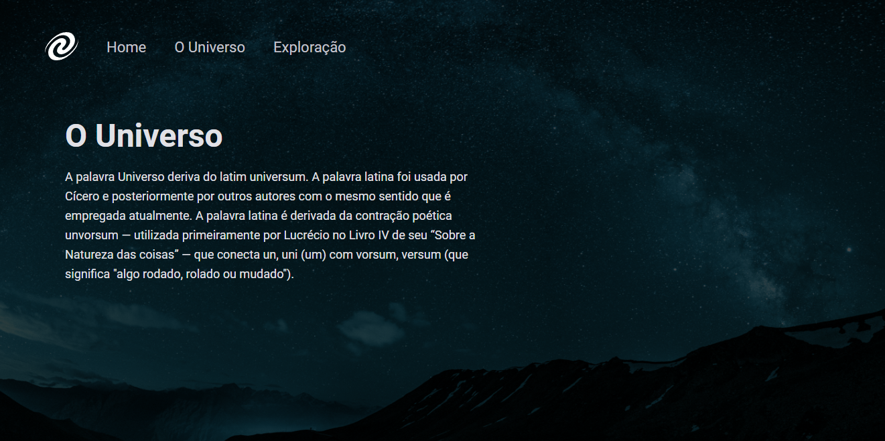

### 💻 SPA Universe



### Para ver esse projeto funcionando corretamente é preciso fazer o download do código, abrir com o VsCode, e executar o LiveServer, ou abrir o terminal e digitar npm start.

Watch it in action Deploy: [Click Here](https://spa-universe-ruddy.vercel.app/)

Mais um desafio concluído com sucesso! Esse é o primeiro desafio do stage 6 - trilha Explorer da Rocketseat. Feito totalmente do zero a partir de um layout do figma, nele eu pude colocar em prática vários novos conceitos adquiridos no stage 6. Para fazer esse desafio eu usei : 

O que foi desenvolvido:

Lógica e Algoritmos com Javascript;
Conceitos de SPA;
Mapeamento de rotas;
Assincronia e promessas;
Orientação a Objetos;
Classes e eventos;
Layout do Figma;
Versão mobile e responsividade com CSS Flex;
Tipos de dados em javascript;
Manipulação do DOM;
Funções Callback;
Código Limpo;
Módulos ES6;
Injeção de Dependência;
Estruturação de HTML com tags semânticas;
Unidade de Medida Flexível;
Pontos de interrupção com media query;
Importando arquivo CSS externo para o projeto;
Aplicando fontes personalizadas (tipografia) no arquivo CSS e iniciando o CSS externo;
Trabalhando com cores e fontes;
Alinhando e posicionando texto e elementos;
Aplicando espaçamento;
Bordas e classificação de elementos;
Transições CSS;
Use variáveis CSS para manipular a paleta de cores do projeto e o tamanho da fonte;
Reset CSS removendo possíveis inconsistências entre diferentes navegadores;
Estrutura do sistema de arquivos do projeto separada por pasta;
Apliquei meus conhecimentos dos conceitos do Explorer da Rocketseat de forma prática neste projeto, com as lições:

Introdução ao HTML e CSS;
Conhecendo novos conceitos de HTML e CSS;
Avançando em HTML e CSS;
Avançando na Programação WEB com Javascript;
Javascript antes do framework;
Conceitos de SPA;
  
<br />

- [EXPLORER - Rocketseat](https://www.rocketseat.com.br/explorer)
- [Design Figma - SPA Universe](https://www.figma.com/file/YyhN52gLNXlFCslwDNO1BL/%5BDesafios-Explorer%5D-SPA-Universe-(Copy))


## 🧪Ferramentas

Aplicação desenvolvida utilizando as seguintes ferramentas:
- [HTML5](https://www.w3schools.com/html/default.asp)
- [CSS3](https://www.w3schools.com/css/default.asp)
- [Javascript](https://developer.mozilla.org/pt-BR/docs/Web/JavaScript)
- [Lite server](https://github.com/johnpapa/lite-server)

## 🚀 Iniciando

Clone o projeto e acesse a pasta e inicie o servidor, é necessário ter o nodeJs instalado e o Visual Studio Code.

Programas necessários para iniciar

- [NodeJS](https://nodejs.org/en/)
- [Live Server (Opcional)](https://marketplace.visualstudio.com/items?itemName=ritwickdey.LiveServer)
- [Visual Studio Code - Vscode](https://code.visualstudio.com/)

Clone the project and access the folder

```bash
$ git clone https://github.com/dsouloficial/spa-universe.git
$ cd spa-universe
```
With nodeJs installed start server

```bash
 $ npm install
 $ npm start
```


## 📝 License

This project is under the MIT license. See the file [LICENSE](LICENSE.md) for more details.

---

&nbsp;

<p align="center">Done with 💜 by Denilson Bernardo👋</p>
